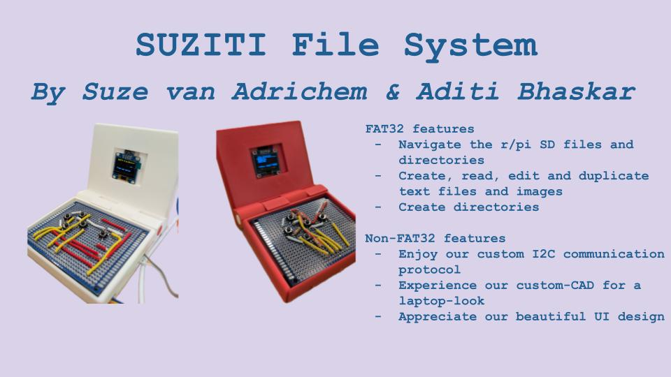

## SUZITI File System
The SUZITI File System is an implementation of the FAT32 file system for the Rasberry Pi (r/pi). We connect it with a small graphical display and 5 buttons to let a user navigate through the filesystem on the SD card of the r/pi, create files/directories and view/edit text and images; all with our own implementation of I2C and gorgeous UI!

### Features:
 - Custom FAT32 implementation for the r/pi
    - Read/write/delete/create/rename/truncate/duplicate files on the pi's SD card
    - Create and navigate directories
    - See fat32.o and main.c; any files starting with fat32
 - Custom I2C communication protocol
    - Communicate between r/pi and graphical display
    - See bitbang-i2c.c
 - Graphical display
    -  Created driver for SSD1306 OLED display based on datasheet
    -  Supports graphics primitives (pixels, shapes, text) and PBM image display
    -  Added support to draw on PBM (image) files and save them to filesystem
    -  See display.c, display.h
  - UI design
    - Made interactive cursor system for drawing
    - Created animated welcome screen with bouncing folder icon
    - See main.c
  - Button matrix
    - Designed and soldered buttons to communicate with r/pi via GPIO
  - "Laptop" 3D print
    - Created custom CAD to hold display and buttons
 
### Team Contributions:
 - Suze: Led fat32 implementation, file navigation, pbm/txt open & edit, UI + design
 - Aditi: Led hardware design, i2c implementation, file and dir create/write/duplicate
 - Together: Wrote display, built/soldered "laptop"

### Citations:
 - display based on adafruit code examples (under obsolete in repo)
